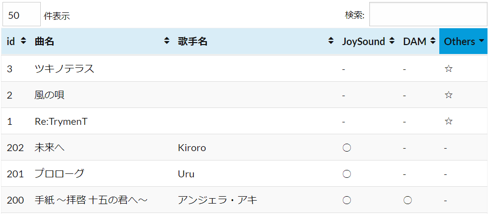
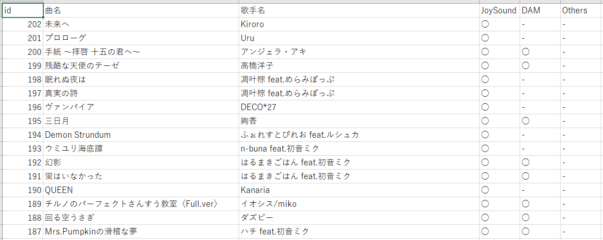

# マイうたDAMcsv化

## 概要
以下の最大4つの**テキストファイルに曲を保存し**、  
本ディレクトリで**`source.py`を実行する**ことで、曲の重複を(~~ほぼ~~)除いて結合させた`result.csv`が出力されます。  
`result.csv`はWordPressのプラグイン「TablePress」にインポートできる形式になっており、  

- DataTablesでインポートしたサンプル  
	[これ](https://apln-n.github.io/pages/KaraokeMyList/)  
	列名をクリックしてソート可能(記号順…○、-、☆もいける)、画像は「Others」でソートした物です
	
- `確認用.csv`のサンプル  
	  

補足: 歌手名が無くても`source.py`は実行可能ではある(特に`JoySound2.txt`、`Others.txt`)

- なので面倒な時は曲名だけで良い

---

## `JoySound1.txt`
[JOYSOUNDのマイうた](https://utasuki.joysound.com/utasuki/mypage/mysong/)に保存されている曲。  
PCで↑を開き、「<strong>登録順</strong>」で全選択(ctrl+a)して`JoySound1.txt`に上書きで貼り付けて保存。  
このときブラウザである程度スクロールしておくと、全選択時の「漏れ」が無くて済む。

- `source.py`実行時に曲数が出てくるので、ブラウザの曲数と合っているか要確認。  

ここに保存した曲は、`result.csv`の<strong>「JoySound」の属性に「J.」</strong>が付きます

※表示(J.)の「.」はWordPressでの検索用です、以下同様

## `JoySound2.txt`
JOYSOUNDのマイうたには無いが検索すると出てくる曲。  
あれば1曲ずつ、「曲名／歌手名」の形式で保存。  

- [サンプルURL](https://github.com/apln-n/Personal-Products/blob/main/%E3%83%9E%E3%82%A4%E3%81%86%E3%81%9FDAMcsv%E5%8C%96/JoySound2.txt)  

ここに保存した曲は、`result.csv`の<strong>「JoySound」の属性に「J.?」</strong>が付きます  

## `DAM1.txt`
[DAMのMYデンモク](https://www.clubdam.com/app/damtomo/mydenmoku/mylistListUp.do?listNo=1)に保存されている曲。  
PCで↑を開き、MYリスト1の画面で全選択して`DAM.txt`に上書きで貼り付ける。  
その後、MYリスト2、3、4と順番に全選択して、↑で貼り付けた物の後ろに追加する形で、**2回以上改行を入れたのち**順次保存。  

- **毎回2回以上の改行をする(強調)**

ここに保存した曲は、`result.csv`の<strong>「DAM」の属性に「D.」</strong>が付きます  

## `DAM2.txt`
上記`JoySound2.txt`と似たような物。  
MYデンモクに保存できなかった曲を手動で「曲名／歌手名」の形式で保存。

ここに保存した曲は、`result.csv`の<strong>「DAM」の属性に「D.?」</strong>が付きます  

## `Others.txt`
JOYSOUND、DAMのどちらの機種にも存在しない曲。  
`JoySound2.txt`と同様に、あれば手動で「曲名／歌手名」の形式で保存。  

- [サンプルURL](https://github.com/apln-n/Personal-Products/blob/main/%E3%83%9E%E3%82%A4%E3%81%86%E3%81%9FDAMcsv%E5%8C%96/Others.txt)

ここに保存した曲は、`result.csv`の<strong>「Others」の属性に「O.」</strong>が付きます  
<!-- 
~~※もし「Others」の属性と「JoySound」or「DAM」の属性に「O」が重複してある場合、`Others.txt`に保存した曲が既にJOYSOUNDかDAMの機種にある可能性があります~~  
-->